# 1 配置Hibernate

1. 在eclipse中安装hibernate tools

   - eclipse中选择Help->Eclipse Marketplace

   - 搜索hibernate

   - 找到JBoss Tools，点击Installed

     

   - 在弹出的一系列可选择的安装插件中，只勾选hibernate，下一步，接受协议，按照提示重启eclipse。

   - 重启后，点击file->new->other，如果出现以下四类文件，说明安装成功了。

     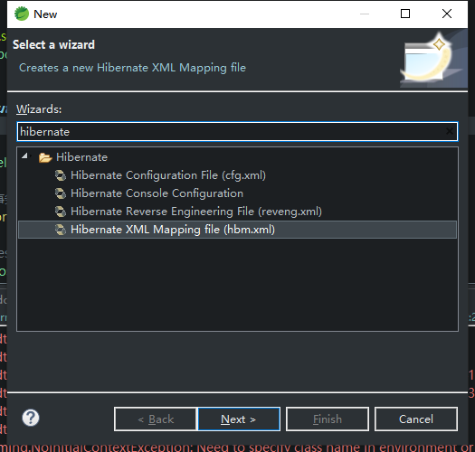

2. 下载hibernate

   - 首先到hibernate官网http://hibernate.org/。点击Hibernate ORM->More。

   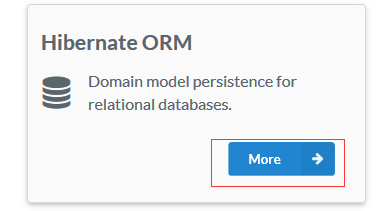

   - 找到左边的release，选择最后一个稳定版本。

   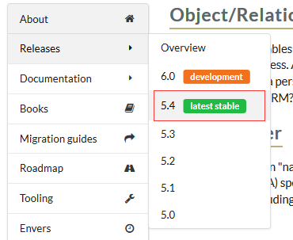

   - 往下翻，选择一个版本点download。

   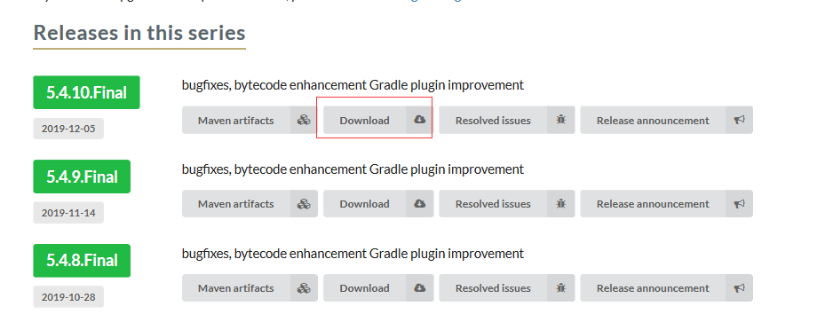

   

3. 导包

   - 新建一个java工程。

   - 新建一个lib目录，打开下载的hibernate压缩包，将其lib->required下所有的包复制到Java工程的lib目录下，并将所有的包添加到buildpath。

   - 将数据库驱动包添加到buildpath。

     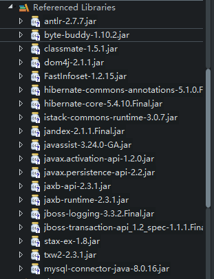

# 2 编写配置文件和POJO类

1. 在src目录下新建一个hibernate configuration 文件。点击下一步使用默认的名称hibernate.cfg.xml。再点下一步，版本选择下载的hibernate包对应的版本。

   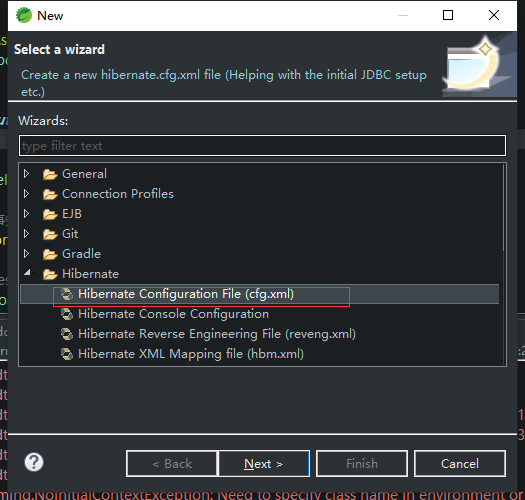

   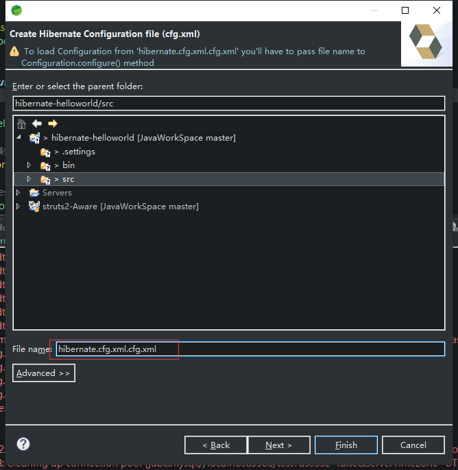

   

   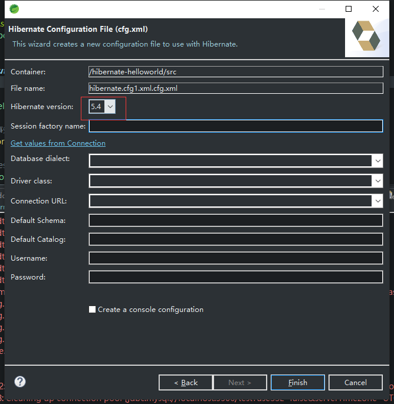

2. 编写hibernate.cfg.xml文件。

   新版的hibernate tools可以不用手动编写xml，直接使用图形界面进行编辑，要配置的内容如下，目前是配置了七个属性：

   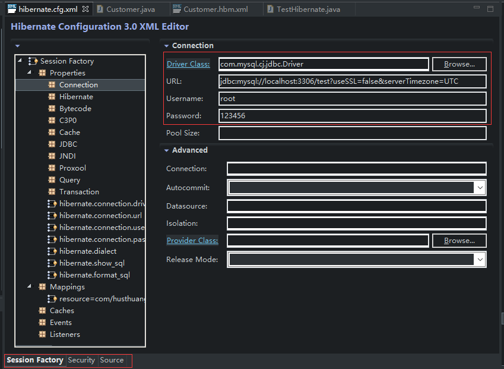

   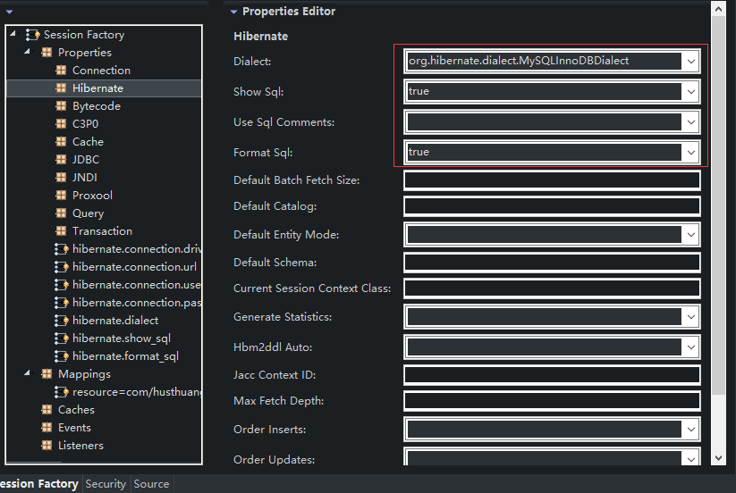

   也可以点source查看xml文件的配置。

   ```xml
   <?xml version="1.0" encoding="UTF-8"?>
   <!DOCTYPE hibernate-configuration PUBLIC "-//Hibernate/Hibernate Configuration DTD 3.0//EN"
                                            "http://www.hibernate.org/dtd/hibernate-configuration-3.0.dtd">
   <hibernate-configuration>
    <session-factory name="">
     <property name="hibernate.connection.driver_class">com.mysql.cj.jdbc.Driver</property>
     <property name="hibernate.connection.url">jdbc:mysql://localhost:3306/test?useSSL=false&amp;serverTimezone=UTC</property>
     <property name="hibernate.connection.username">root</property>
     <property name="hibernate.connection.password">123456</property>
     <property name="hibernate.dialect">org.hibernate.dialect.MySQLInnoDBDialect</property>
     <property name="hibernate.show_sql">true</property>
     <property name="hibernate.format_sql">true</property>
    </session-factory>
   </hibernate-configuration>
   
   ```

   

3. 编写pojo类

   首先有一张数据库表：

   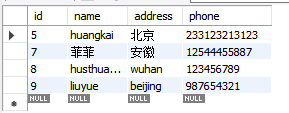

   表名是customer。

   编写一个POJO类，类名和表名相同，字段名和列名相同，并生成get/set方法，带参构造器和无参构造器，toString方法等。

   ```java
   package com.husthuangkai.pojo;
   
   public class Customer {
       private Integer id;
       private String name;
       private String address;
       private String phone;
       public Integer getId() {
           return id;
       }
       public void setId(Integer id) {
           this.id = id;
       }
       public String getName() {
           return name;
       }
       public void setName(String name) {
           this.name = name;
       }
       public String getAddress() {
           return address;
       }
       public void setAddress(String address) {
           this.address = address;
       }
       public String getPhone() {
           return phone;
       }
       public void setPhone(String phone) {
           this.phone = phone;
       }
       public Customer() {
           super();
           // TODO Auto-generated constructor stub
       }
       public Customer(String name, String address, String phone) {
           super();
           this.name = name;
           this.address = address;
           this.phone = phone;
       }
       @Override
       public String toString() {
           return "Customer [id=" + id + ", name=" + name + ", address=" + address + ", phone=" + phone + "]";
       }
       
   }
   
   ```

   

   

4. 编写xxx.hbm.xml配置文件

   这个就是为这个pojo编写一个配置文件，描述其字段和数据库列明的对应关系等。

   新建一个hibernate xml mapping file，下一步，选择对应的Class。

   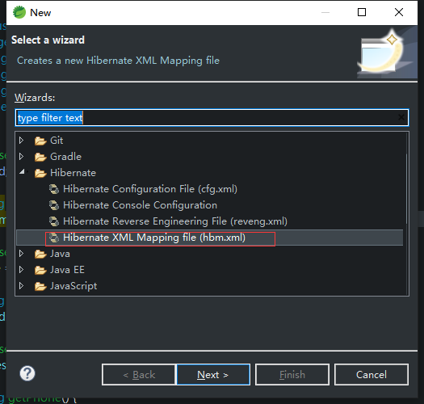

   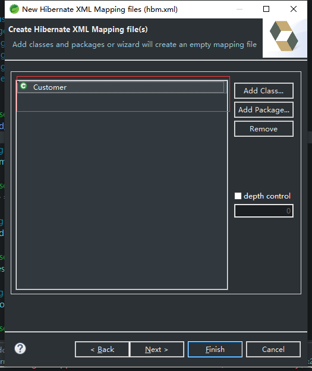

   会自动生成一个配置好的文件，一般而言不需要改动。

   ```xml
   <?xml version="1.0"?>
   <!DOCTYPE hibernate-mapping PUBLIC "-//Hibernate/Hibernate Mapping DTD 3.0//EN"
   "http://hibernate.sourceforge.net/hibernate-mapping-3.0.dtd">
   <!-- Generated 2019-12-16 9:48:39 by Hibernate Tools 3.5.0.Final -->
   <hibernate-mapping>
       <class name="com.husthuangkai.pojo.Customer" table="CUSTOMER">
           <id name="id" type="java.lang.Integer">
               <column name="ID" />
               <generator class="native" />
           </id>
           <property name="name" type="java.lang.String">
               <column name="NAME" />
           </property>
           <property name="address" type="java.lang.String">
               <column name="ADDRESS" />
           </property>
           <property name="phone" type="java.lang.String">
               <column name="PHONE" />
           </property>
       </class>
   </hibernate-mapping>
   
   ```
   

   
5. 在hibernate.cfg.xml中配置mapping

   在hibernate.cfg.xml中加一行

   ```xml
     <mapping resource="com/husthuangkai/pojo/Customer.hbm.xml"/>
   ```

   

   # 3 实现增删改查

   新建一个JunitTest

   ```java
   package com.husthuangkai.test;
   
   
   import org.hibernate.Session;
   import org.hibernate.SessionFactory;
   import org.hibernate.Transaction;
   import org.hibernate.cfg.Configuration;
   import org.junit.jupiter.api.Test;
   
   import com.husthuangkai.pojo.Customer;
   
   class TestHibernate {
   
       @Test
       void test() {
           // 1.创建Configuration对象并加载hibernate.cfg.xml文件，默认为 “/hibernate.cfg.xml”，如果放在其他位置则要传入参数
           Configuration configuration = new Configuration().configure();
           
           // 2.创建SessionFactory
           SessionFactory sessionFactory = configuration.buildSessionFactory();
           
           // 3.创建session对象
           Session session = sessionFactory.openSession();
           
           // 4.开启事务
           Transaction transaction = session.beginTransaction();
           
           // 5.执行操作
           Customer customer = new Customer("liuyue", "wuhan", "987654321");
           // 增加
           session.save(customer);
           
           // 修改
           customer.setAddress("beijing");
           session.update(customer);
           
           // 查询
           System.out.println(session.get(Customer.class, 7));
           
           // 删除
           session.delete(session.get(Customer.class, 6));
           
           // 6.提交事务
           transaction.commit();
           
           // 7.关闭session
           session.close();
           
           // 8.关闭sessionFactory
           sessionFactory.close();
       }
   
   }
   
   ```

   