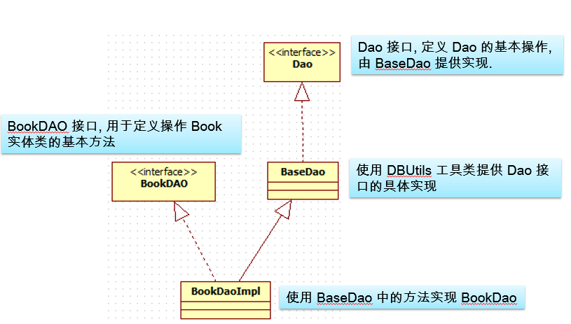
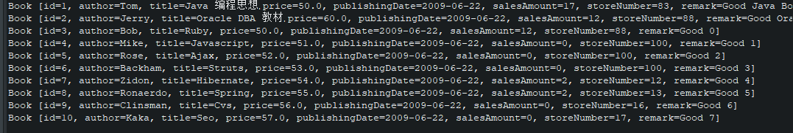

* content
{:toc}
这一篇介绍DAO层的设计。


# 0 Dao层设计




# 1 配置环境

1. 导包

   在WebContent->WEB-INF->lib目录下加入以下jar包

   c3p0-0.9.1.2.jar

   mysql-connector-java-8.0.16.jar

   commons-dbutils-1.7.jar

2. 配置c3p0数据源

   在Java Resources->src下加入c3p0-config.xml文件，内容如下：

   ```xml
   <?xml version="1.0" encoding="UTF-8"?>
   <c3p0-config>
     <named-config name="bookStore"> 
     
       <property name="user">root</property>
       <property name="password">123456</property>
       <property name="driverClass">com.mysql.cj.jdbc.Driver</property>
       <property name="jdbcUrl">jdbc:mysql://localhost:3306/bookstore?useSSL=false&amp;serverTimezone=UTC&amp;allowPublicKeyRetrieval=true</property>
     
       <property name="acquireIncrement">5</property>
       <property name="initialPoolSize">10</property>
       <property name="minPoolSize">5</property>
       <property name="maxPoolSize">50</property>
   
       <property name="maxStatements">20</property> 
       <property name="maxStatementsPerConnection">5</property>
   
     </named-config>
   </c3p0-config>
   ```


# 2 写Dao\<T\>接口

Dao\<T\>接口用来定义Dao的基本操作，具体实现由BaseDao\<T\>类实现：

```java
package com.husthuangkai.bookStore.Dao;

import java.util.List;

/**
 * Dao接口，定义Dao的基本操作，由BaseDao实现
 * 
 * @param <T> 实际操作的泛型类型
 */
public interface Dao<T> {

    /*
     * 插入
     */
    public void insert(String sqlString, Object... objects);

    /*
     * 更新
     */
    public void update(String sqlString, Object... objects);
    
    /*
     * 批量更新
     */
    public void batchUpdate(String sqlString, Object[]... objects);

    /*
     * 查询单个对象
     */
    public T query(String sqlString, Object... objects);

    /*
     * 查询一组对象
     */
    public List<T> queryForList(String sqlString, Object... objects);

    /*
     * 查询某个值
     */
    public <V> V queryForValue(String sqlString, Object... objects);
}

```


# 2 编写JdbcUtil工具类

这个类主要用来创建连接池，获取连接和返还连接。

```java
package com.husthuangkai.bookStore.Dao;

import java.sql.Connection;
import java.sql.SQLException;

import javax.sql.DataSource;

import com.mchange.v2.c3p0.ComboPooledDataSource;

/*
 * 利用连接池管理连接，可以从这个类中获得连接和返回连接
 */
public class JdbcUtil {

    private static DataSource dataSource = null;
    
    static {
        dataSource = new ComboPooledDataSource("bookStore"); // 此处填入c3p0配置文件中配置的连接池名称
    }
    
    /**
     * @return 返回一个数据库连接
     * @throws SQLException 
     */
    public static Connection getConnection() throws SQLException {
            return dataSource.getConnection();
    }
    
    /**
     * @param connection 关闭此连接
     */
    public static void closeConnection(Connection connection) {
        try {
            if (connection != null) {
                connection.close();
            }

        } catch (SQLException e) {
            // TODO Auto-generated catch block
            e.printStackTrace();
        }
    }
}

```


# 4 编写BaseDao\<T\>类

BaseDao\<T\>类实现Dao接口定义的操作，具体的就是根据sql语句进行增删改查。

```java
package com.husthuangkai.bookStore.Dao;

import java.lang.reflect.ParameterizedType;
import java.lang.reflect.Type;
import java.sql.Connection;
import java.sql.SQLException;
import java.util.List;

import org.apache.commons.dbutils.QueryRunner;
import org.apache.commons.dbutils.handlers.BeanHandler;
import org.apache.commons.dbutils.handlers.BeanListHandler;
import org.apache.commons.dbutils.handlers.ScalarHandler;


public class BaseDao<T> implements Dao<T> {

    // dbUtils 中的工具类
    private QueryRunner queryRunner = new QueryRunner();

    private Class<T> clazz;

    // 在构造函数中获得 clazz
    public BaseDao() {
        Type superClass = getClass().getGenericSuperclass();

        if (superClass instanceof ParameterizedType) {
            ParameterizedType parameterizedType = (ParameterizedType) superClass;

            Type[] types = parameterizedType.getActualTypeArguments();
            if (types != null && types.length > 0) {
                if (types[0] instanceof Class) {
                    clazz = (Class<T>) types[0];
                }
            }
        }
    }
    
    /*
     * 插入
     */
    @Override
    public void insert(String sqlString, Object... objects) {
        Connection connection = null;
        try {
            connection = JdbcUtil.getConnection();
            queryRunner.update(connection, sqlString, objects);
        } catch (SQLException e) {
            e.printStackTrace();
        } finally {
            JdbcUtil.closeConnection(connection);
        }
    }

    /*
     * 修改
     */
    @Override
    public void update(String sqlString, Object... objects) {
        Connection connection = null;
        try {
            connection = JdbcUtil.getConnection();
            queryRunner.update(connection, sqlString, objects);
        } catch (Exception e) {
            e.printStackTrace();
        } finally {
            JdbcUtil.closeConnection(connection);
        }
    }

    /*
     * 批量更新
     */
    @Override
    public void batchUpdate(String sqlString, Object[]... objects) {
        Connection connection = null;
        try {
            connection = JdbcUtil.getConnection();
            queryRunner.batch(connection, sqlString, objects);
        } catch (SQLException e) {
            e.printStackTrace();
        } finally {
            JdbcUtil.closeConnection(connection);
        }
    }

    /*
     * 单个查询
     */
    @Override
    public T query(String sqlString, Object... objects) {
        Connection connection = null;
        try {
            connection = JdbcUtil.getConnection();
            return queryRunner.query(connection, sqlString, new BeanHandler<>(clazz), objects);
        } catch (SQLException e) {
            e.printStackTrace();
        } finally {
            JdbcUtil.closeConnection(connection);
        }
        return null;
    }

    @Override
    public List<T> queryForList(String sqlString, Object... objects) {
        Connection connection = null;
        try {
            connection = JdbcUtil.getConnection();
            return queryRunner.query(connection, sqlString, new BeanListHandler<>(clazz), objects);
        } catch (SQLException e) {
            e.printStackTrace();
        } finally {
            JdbcUtil.closeConnection(connection);
        }
        return null;
    }

    @Override
    public <V> V queryForValue(String sqlString, Object... objects) {
        Connection connection = null;
        try {
            connection = JdbcUtil.getConnection();
            return queryRunner.query(connection, sqlString, new ScalarHandler<V>(), objects);
        } catch (SQLException e) {
            e.printStackTrace();
        } finally {
            JdbcUtil.closeConnection(connection);
        }
        return null;
    }

}

```


# 5 POJO类编写

POJO类就是我们要查的实体列，具体而言就是一张表对应一个类。我们实现一个Book类的查询作为示例。

```java
package com.husthuangkai.bookStore.Bean;

import java.sql.Date;

public class Book {

    private Integer id;
    
    private String author;
    
    private String title;
    
    private Double price;
    
    private Date publishingDate;
    
    private Integer salesAmount;
    
    private Integer storeNumber;
    
    private String remark;

    public Integer getId() {
        return id;
    }

    public void setId(Integer id) {
        this.id = id;
    }

    public String getAuthor() {
        return author;
    }

    public void setAuthor(String author) {
        this.author = author;
    }

    public String getTitle() {
        return title;
    }

    public void setTitle(String title) {
        this.title = title;
    }

    public Double getPrice() {
        return price;
    }

    public void setPrice(Double price) {
        this.price = price;
    }

    public Date getPublishingdate() {
        return publishingDate;
    }

    public void setPublishingdate(Date publishingdate) {
        this.publishingDate = publishingdate;
    }

    public Integer getSalesamount() {
        return salesAmount;
    }

    public void setSalesamount(Integer salesamount) {
        this.salesAmount = salesamount;
    }

    public Integer getStorenumber() {
        return storeNumber;
    }

    public void setStorenumber(Integer storenumber) {
        this.storeNumber = storenumber;
    }

    public String getRemark() {
        return remark;
    }

    public void setRemark(String remark) {
        this.remark = remark;
    }

    public Book() {
        super();
        // TODO Auto-generated constructor stub
    }

    public Book(Integer id, String author, String title, Double price, Date publishingdate, Integer salesamount,
            Integer storenumber, String remark) {
        super();
        this.id = id;
        this.author = author;
        this.title = title;
        this.price = price;
        this.publishingDate = publishingdate;
        this.salesAmount = salesamount;
        this.storeNumber = storenumber;
        this.remark = remark;
    }

    @Override
    public String toString() {
        return "Book [id=" + id + ", author=" + author + ", title=" + title + ", price=" + price + ", publishingDate="
                + publishingDate + ", salesAmount=" + salesAmount + ", storeNumber=" + storeNumber + ", remark="
                + remark + "]";
    }

    
}

```


# 6 BookDaoImpl类

这个类继承BaseDao类，实现bookDao接口。因此可以使用BaseDao类里实现的方法来实现bookDao接口的要求。

下面只实现了一个查询方法，功能是从mybooks表中第i行开始，查询j行数据。这个方法主要是分页查询时会使用到，其他的方法可以在有需要时再添加。

```java
package com.husthuangkai.bookStore.DaoImpl;

import java.util.List;

import com.husthuangkai.bookStore.Bean.Book;
import com.husthuangkai.bookStore.Dao.BaseDao;
import com.husthuangkai.bookStore.Dao.BookDao;

public class BookDaoImpl extends BaseDao<Book> implements BookDao {

    @Override
    public List<Book> queryBooks(Integer i, Integer j) {
        String sqlString = "SELECT * FROM mybooks Limit ?,?";
        return queryForList(sqlString, i, j);
    }
}

```


# 7 测试

使用JUnit进行测试

```java
package test;

import java.util.List;

import com.husthuangkai.bookStore.Bean.Book;
import com.husthuangkai.bookStore.Dao.BookDao;
import com.husthuangkai.bookStore.DaoImpl.BookDaoImpl;

class Test {

    @org.junit.jupiter.api.Test
    void test() {
        BookDao bookDao = new BookDaoImpl();
        List<Book> books = bookDao.queryBooks(0, 10);
        for (Book book : books) {
            System.out.println(book);
        }
    }
}

```

结果：



输出了十条记录，结果正确。

其他的POJO用相同的流程编写Dao，就不再赘述。