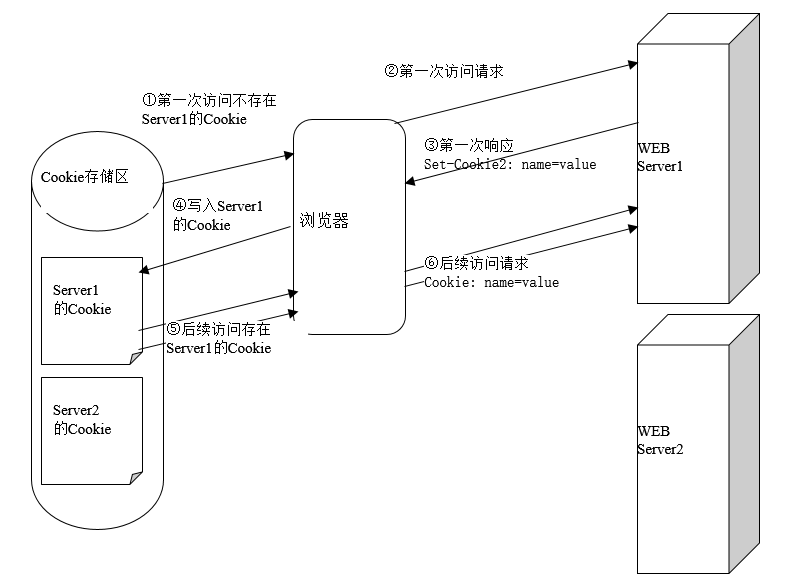

# Cookie

## 1 Cookie机制

1. cookie机制采用的是在客户端保持 HTTP 状态信息的方案 
2. Cookie是在浏览器访问WEB服务器的某个资源时，由**WEB服务器在HTTP响应消息头中附带传送给浏览器的一个小文本文件**。 
3. 一旦WEB浏览器保存了某个Cookie，那么它在以后每次访问该WEB服务器时，都会在HTTP请求头中将这个Cookie回传给WEB服务器。
4. 底层的实现原理： WEB服务器通过在HTTP响应消息中增加Set-Cookie响应头字段将Cookie信息发送给浏览器，浏览器则通过在HTTP请求消息中增加Cookie请求头字段将Cookie回传给WEB服务器。
5. 一个Cookie只能标识一种信息，它至少含有一个标识该信息的名称（NAME）和设置值（VALUE）。 
6. 一个WEB站点可以给一个WEB浏览器发送多个Cookie，一个WEB浏览器也可以存储多个WEB站点提供的Cookie。
7. 浏览器一般只允许存放300个Cookie，每个站点最多存放20个Cookie，每个Cookie的大小限制为4KB。

## 2 Cookie传送过程示意图

