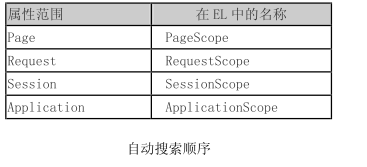
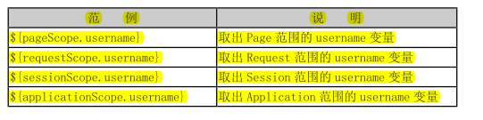
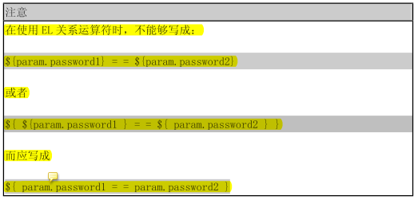
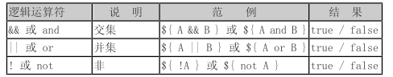

# EL表达式

## 1 EL语法

EL 提供 . 和 [ ] 两种运算符来存取数据。下列两者所代表的意思是一样的： 

```jsp
${sessionScope.user.sex} 

${sessionScope.user["sex"]} 
```

不过，以下两种情况，两者会有差异： 

1. 当要存取的属性名称中包含一些特殊字符，如 . 或 – 等并非字母或数字的符号，就一定
   要使用 [ ]，例如： 

   ```jsp
   ${user.My-Name }  
   ```

2. 我们来考虑下列情况： 

   ```jsp
   ${sessionScope.user[data]} 
   ```

   此时，data 是一个变量，假若 data 的值为"sex"时，那上述的例子等于${sessionScope.user.sex}；
   假若 data 的值为"name"时，它就等于${sessionScope.user.name}。因此，如果要动态取值时，就可以
   用上述的方法来做，但  .  无法做到动态取值。


## 2 EL变量







## 3 EL隐含对象

1. 与范围有关的隐含对象 

    applicationScope 
    sessionScope 
    requestScope 
    pageScope 

2. 与输入有关的隐含对象 

   param 
   paramValues 

3. 其他隐含对象 

   cookie 
   header 
   headerValues 
   initParam 
   pageContext 


## 4 EL运算符

1. 算数运算符

   +、-、*、\、%

2. 关系运算符

   

   

3. 逻辑运算符

   

   

4. 其他运算符

   

   

