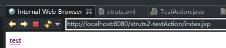
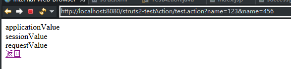
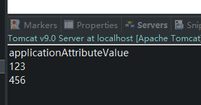

# 1 在Action中访问WEB资源

1. 什么时WEB资源？

   HttpServletRequest、HttpSession、ServletContext等原生的ServletAPI。

2. 为什么需要访问WEB资源？

   B\S的应用的Controller中必然需要访问WEB资源。

3. 如何访问？

   - 和ServletAPI解耦的方式：只能访问有限的ServletAPI对象，且只能访问其有限的方法（读取请求参数，读写域对象的属性等）

     - 使用ActionContext

       在jsp中为application配置一个属性。

       添加到test.action的超链接，设置请求参数为name=123&name=456。

       ```jsp
       <%application.setAttribute("applicationAttribute", "applicationAttributeValue"); %>
       <a href="test.action?name=123&name=456">test</a>
       ```

       配置action

       ```xml
       <action name="test" class="com.husthuangkai.structs2.action.TestAction" method="test">
       	<result name="success" type="dispatcher">/success.jsp</result>
       </action>
       ```

       写TestAction类

       ```java
       package com.husthuangkai.structs2.action;
       
       import java.util.Map;
       
       import com.opensymphony.xwork2.ActionContext;
       
       public class TestAction {
       
           public String test() {
               
               // 1. 获取application的属性map
               Map<String, Object> applicationMap = ActionContext.getContext().getApplication();
               System.out.println(applicationMap.get("applicationAttribute"));
               applicationMap.put("applicationKey", "applicationValue");
               
               // 2. 获取session的属性map
               Map<String, Object> sessionMap = ActionContext.getContext().getSession();
               sessionMap.put("sessionKey", "sessionValue");
               
               // 3. 获取request的属性map
               Map<String, Object> requestMap = (Map<String, Object>) ActionContext.getContext().get("request");
               requestMap.put("requestKey", "requestValue");
               
               // 4. 获取请求参数的map
               // 注意：这个Map中的Value是String[]类型，表示该请求参数的name对应的value数组
               // 且这个Map只能读，不能写，即使写了，在下个页面中也不会生效
               Map<String, Object> paramMap = ActionContext.getContext().getParameters();
               String[] values = (String[]) paramMap.get("name");
               for(String value : values) {
                   System.out.println(value);
               }
                
               return "success";
           }
           
       }
       
       ```

       写success.jsp

       ```jsp
       ${applicationScope.applicationKey }
       <br>
       ${sessionScope.sessionKey }
       <br>
       ${requestScope.requestKey }
       <br>
       
       <a href="${pageContext.request.contextPath }/index.jsp">返回</a>
       ```

       效果：

       

       

       

       

     - 实现XxxAware接口

       jsp不变。

       配置action：

       ```xml
       <action name="testAware" class="com.husthuangkai.structs2.action.TestAware" method="testAware">
       	<result name="success" type="dispatcher">/success.jsp</result>
       </action>
       ```

       写TestAware类：

       ```java
       package com.husthuangkai.structs2.action;
       
       import java.util.Map;
       
       import org.apache.struts2.interceptor.ApplicationAware;
       import org.apache.struts2.interceptor.ParameterAware;
       import org.apache.struts2.interceptor.RequestAware;
       import org.apache.struts2.interceptor.SessionAware;
       
       public class TestAware implements ApplicationAware, SessionAware, RequestAware, ParameterAware {
       
           private Map<String, Object> applicationMap = null;
           private Map<String, Object> sessionMap = null;
           private Map<String, Object> requestMap = null;
           private Map<String, String[]> paramMap = null;
           
           public String testAware() {
               applicationMap.put("applicationKey", "applicationValue");
               sessionMap.put("sessionKey", "sessionValue");
               requestMap.put("requestKey", "requestValue");
               for (String param : paramMap.get("name")) {
                   System.out.println(param);
               }
               return "success";
           }
           
           @Override
           public void setApplication(Map<String, Object> arg0) {
              applicationMap = arg0;
           }
       
           @Override
           public void setRequest(Map<String, Object> arg0) {
               requestMap = arg0;
           }
       
           @Override
           public void setSession(Map<String, Object> arg0) {
               sessionMap = arg0;
           }
       
           @Override
           public void setParameters(Map<String, String[]> arg0) {
               paramMap = arg0;
           }
       }
       
       ```

     - 选用的建议：若一个Action类中有多个action方法，且多个方法都需要使用域对象的Map或parameters，则建议使用Aware接口方式。

     - session对应的Map实际上是SessionMap类型的，强转后可以调用其invalidate方法使session失效。

   - 和ServletAPI耦合的方式：可以访问更多的ServletAPI对象，且可以调用其原生方法。

     - 使用ServletActionContext

       ```java
       package com.husthuangkai.structs2.action;
       
       import javax.servlet.ServletContext;
       import javax.servlet.http.HttpServletRequest;
       import javax.servlet.http.HttpSession;
       
       import org.apache.struts2.ServletActionContext;
       
       public class TestServletActionContext {
       
           public String testServletActionContext() {
               HttpServletRequest request = ServletActionContext.getRequest();
               HttpSession session = request.getSession();
               ServletContext context = ServletActionContext.getServletContext();
               
               return "success";
           }
           
       }
       
       ```

       

     - 实现ServletXxxAware接口

       ```java
       package com.husthuangkai.structs2.action;
       
       import javax.servlet.ServletContext;
       import javax.servlet.http.HttpServletRequest;
       import javax.servlet.http.HttpServletResponse;
       import javax.servlet.http.HttpSession;
       
       import org.apache.struts2.interceptor.ServletRequestAware;
       import org.apache.struts2.interceptor.ServletResponseAware;
       import org.apache.struts2.util.ServletContextAware;
       
       
       public class TestServletAware implements ServletRequestAware, ServletContextAware, ServletResponseAware {
       
           private HttpServletRequest request = null;
           private HttpSession session = null;
           private HttpServletResponse response = null;
           private ServletContext context = null;
           
           @Override
           public void setServletResponse(HttpServletResponse arg0) {
               response = arg0;
           }
       
           @Override
           public void setServletContext(ServletContext arg0) {
               context = arg0;
           }
       
           @Override
           public void setServletRequest(HttpServletRequest arg0) {
               request = arg0;
               session = request.getSession();
           }
       
       }
       
       ```


# 2 关于Action类

1. 将Action类的字段名称按照JavaBeans的命名规则来命名，并生成getter和setter方法，这样如果有同名的请求参数，structs框架就会自动将请求参数赋给这个字段。名且会自动进行字符串到其他类型的转换。
2. 必须有无参构造器，因为action方法需要通过反射来调用。
3. 至少有一个供action调用的方法。
4. structs会为每一个请求创建一个新的Action实例，即Action不是单例的。


# 3 关于struts请求的扩展名问题

默认情况下，struts可以拦截扩展名为.action和没有扩展名的请求，这配置在struts2-core-2.3.15.3.jar/org/apache/struts2/default.properties文件中。

> struts.action.extension=action,,

可以在structs的配置文件中对这个值进行配置

```xml
<constant name="struts.action.extension" value="do,action"></constant>
```

