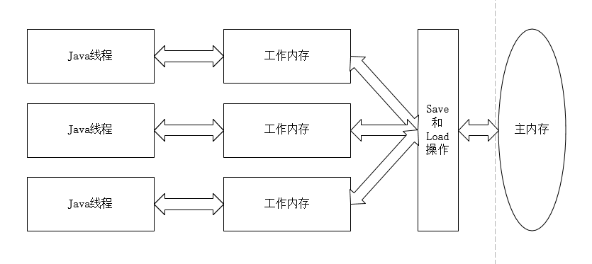

1.概述
并发处理是“压榨”计算机运算能力的有力武器。
一个服务端同时对多个客户端提供服务是一个具体的并发应用场景，而java语言非常擅长服务端开发，java语言和虚拟机提供了许多工具，方便并发编程。但是要真正掌握“高效并发”，程序员必须了解并发内幕。

2.硬件的效率与一致性
由于CPU的运算速度和内存的读写速度存在着几个数量级的差距，所以引入了高速缓存（Cache）来解决CPU和内存之间的矛盾。但在多处理器环境下，这又引入了一个新的问题——缓存一致性问题。每个处理器都有自己的高速缓存，而他们又共享一块主存，当多个处理器的运算任务涉及同一块主存内存区域时，将可能导致各自的缓存数据不一致。这就需要缓存一致性协议来解决这个问题。
除了增加高速缓存外，还引入了指令重排序来优化运行速度，处理器不保证输入代码的执行顺序，但是保证输出结果与顺序执行是一致的。

3.java内存模型
java内存模型是jvm规范定义的，目的是屏蔽掉各种硬件和操作系统之间的内存访问差异，以实现java内存访问的跨平台一致性。

（1）主存与工作内存
Java内存模型的主要目标是定义程序中各个变量的访问控制，即在虚拟机中将变量存储到内存和从内存中取出变量这样的底层细节。
变量包括实例字段、静态字段和构成数组对象的元素，不包括局部变量与方法参数，因为后者是线程私有的。
线程的工作内存中保存了该线程所使用的变量的主内存副本拷贝，线程对变量的所有操作都在工作内存中进行，不能直接读写主内存中的变量，也不可以访问其他线程的工作内存。
线程间的通信需要靠对主存的读写来完成。  

