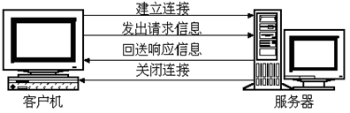
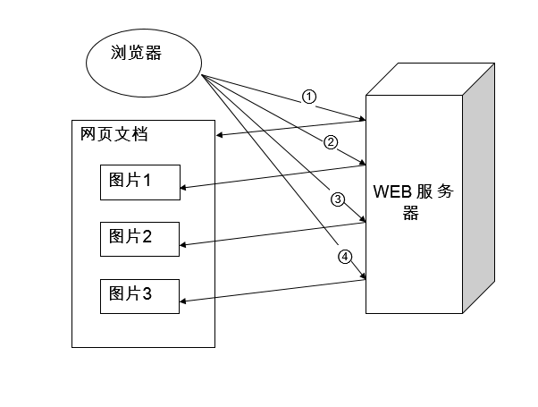
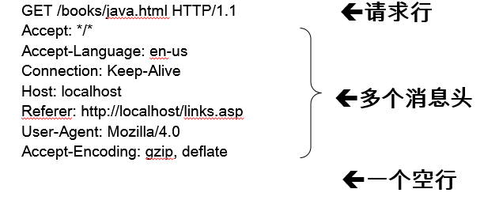
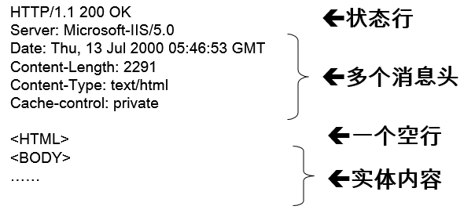

# HTTP

## 1 HTTP简介

1. WEB浏览器与WEB服务器之间的一问一答的交互过程必须遵循一定的规则，这个规则就是HTTP协议。
2. HTTP是 hypertext transfer protocol（超文本传输协议）的简写，它是 TCP/IP 协议集中的一个应用层协议，**用于定义WEB浏览器与WEB服务器之间交换数据的过程以及数据本身的格式**。 
3. HTTP协议的版本 HTTP/1.0、HTTP/1.1、HTTP-NG 

## 2 HTTP的会话方式

### 2.1 HTTP连接过程



​		浏览器与WEB服务器的连接过程是**短暂**的，每次连接只处理一个请求和响应。对每一个页面的访问，浏览器与WEB服务器都要建立一次单独的连接。 
​		浏览器到WEB服务器之间的所有通讯都是完全独立分开的请求和响应对。

### 2.2 浏览器访问多图网页的过程：



### 2.3 HTTP请求消息

1. 请求消息的结构：

   一个请求行、若干消息头、以及实体内容，其中的一些消息头和实体内容都是可选的，消息头和实体内容之间要用空行隔开。 

2. 举例

   

### 2.4 HTTP响应消息

1. 响应消息的结构：
   一个状态行、若干消息头、以及实体内容 ，其中的一些消息头和实体内容都是可选的，消息头和实体内容之间要用空行隔开。 

2. 举例：

   

   ### 2.5 使用GET和POST方式传递参数

   1. 在URL地址后面可以附加一些参数
      	举例：http://www.it315.org/servlet/ParamsServlet?param1=abc&param2=xyz

   2. GET方式
      	举例：GET /servlet/ParamsServlet?param1=abc&param2=xyz HTTP/1.1
      	特点：传送的数据量是有限制的，一般限制在1KB以下。

      ```html
      <form action="LoginServlet" method="get">
      	
      		user: <input type="text" name="user"/>
      		password: <input type="password" name="password"/>
      		
      		<input type="submit" value="Submit"/>
      </form>
      ```

      

   3. POST方式
      	举例：
      	POST /servlet/ParamsServlet HTTP/1.1
      	Host:
      	Content-Type: application/x-www-form-urlencoded
      	Content-Length: 28

      ​	特点：

      ​	param1=abc&param2=xyz
      ​	特点：传送的数据量要比GET方式传送的数据量大得多 。

      ```html
      <form action="LoginServlet" method="post">
      	
      		user: <input type="text" name="user"/>
      		password: <input type="password" name="password"/>
      		
      		<input type="submit" value="Submit"/>
      </form>
      ```

      