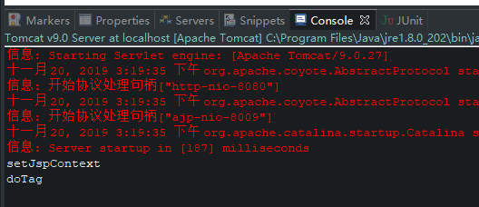
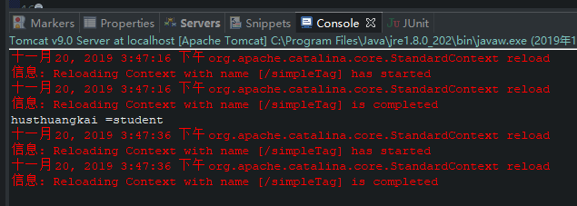
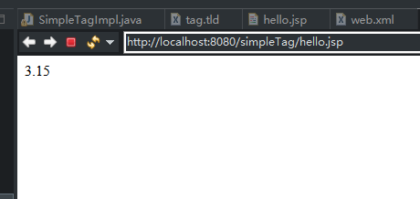
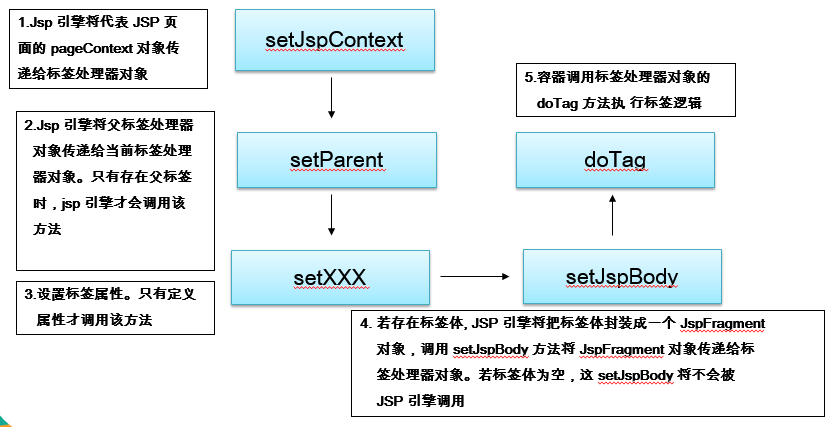
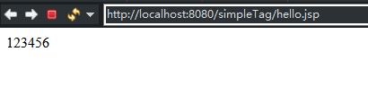

# JSP自定义标签

## 1 什么是自定义标签

用户定义的一种自定义的jsp标记 。当一个含有自定义标签的jsp页面被jsp引擎编译成servlet时，tag标签被转化成了对一个称为 **标签处理类** 的对象的操作。于是，当jsp页面被jsp引擎转化为servlet后，实际上tag标签被转化为了对tag处理类的操作。

## 2 自定义标签的定义步骤

1. 编写完成标签功能的 Java 类(标签处理器)，实现 SimpleTag 接口

   ```java
   public class SimpleTagImpl implements javax.servlet.jsp.tagext.SimpleTag {
   
       @Override
       public void doTag() throws JspException, IOException {
           System.out.println("doTag");
       }
   
       @Override
       public JspTag getParent() {
           System.out.println("getParent");
           return null;
       }
   
       @Override
       public void setJspBody(JspFragment jspBody) {
           System.out.println("setJspBody");
       }
   
       @Override
       public void setJspContext(JspContext pc) {
           System.out.println("setJspContext");
       }
   
       @Override
       public void setParent(JspTag parent) {
           System.out.println("setParent");
       }
   
   }
   ```

2. 编写标签库描述(tld)文件，在tld文件中对自定义中进行描述

   ```xml
   <?xml version="1.0" encoding="UTF-8"?>
   <taglib
   xmlns="http://java.sun.com/xml/ns/j2ee"
   xmlns:xsi="http://www.w3.org/2001/XMLSchema-instance"
   xsi:schemaLocation="http://java.sun.com/xml/ns/j2ee web-jsptaglibrary_2_0.xsd"
   version="2.0">
       <description>JSTL 1.1 core library</description>
       <display-name>JSTL creo</display-name>
       <tlibversion>1.0</tlibversion>
       
       <!-- 标签库的名字-->
       <shortname>taglib</shortname>
       
       <!-- 标签库的uri，导入此标签库时使用 -->
       <uri>http://www.husthuangkai.jsp.com/taglib</uri>
       
       <!-- 定义一个标签 -->
       <tag>
           <name>hello</name>
           <tagclass>com.husthuangkai.tag.SimpleTagImpl</tagclass>
           <bodycontent>empty</bodycontent>
       </tag>
   </taglib>
   ```

3. 在 JSP 页面中导入和使用自定义标签

   ```jsp
   <%@taglib uri="http://www.husthuangkai.jsp.com/taglib" prefix="taglib" %>
   ```

4. 使用自定义标签

   ```jsp
   <%@ page language="java" contentType="text/html; charset=UTF-8"
       pageEncoding="UTF-8"%>
       
   <%@taglib uri="http://www.husthuangkai.jsp.com/taglib" prefix="taglib" %>
   
   <!DOCTYPE html>
   <html>
   <head>
   <meta charset="UTF-8">
   <title>Insert title here</title>
   </head>
   <body>
   <taglib:hello/>
   </body>
   </html>
   ```

   效果：

   


## 2 自定义标签的属性定义

1. setJspContext(JspContext pc)方法一定会被 JSP 引擎，首先调用，因此可以在这里面初始化 pageContext 变量。

   ```java
   	private PageContext pageContext = null;    
   
   	@Override
       public void setJspContext(JspContext pc) {
           pageContext = (PageContext) pc;
       }
   
   ```

2. 先在处理器类中定义 setter 方法，建议把所有的属性都设为 String 类型。

   ```java
       private String value;
       private String count;
       
       public String getValue() {
           return value;
       }
   
       public void setValue(String value) {
           this.value = value;
       }
   
       public String getCount() {
           return count;
       }
   
       public void setCount(String count) {
           this.count = count;
       }
   ```

3. 在 .tld 文件中描述属性

   ```xml
       <!-- 定义一个标签 -->
       <tag>
           <name>hello</name>
           <tagclass>com.husthuangkai.tag.SimpleTagImpl</tagclass>
           <bodycontent>empty</bodycontent>
           
           <!-- 描述标签的属性 -->
           <attribute>
               <!-- 属性名,需和标签处理类的属性名相同 -->
               <name>value</name>
               
               <!-- 属性是否必须 -->
               <required>true</required>
               
               <!-- 当前属性否可以接受运行时表达式的动态值 -->
               <rtexprvalue>true</rtexprvalue>
           </attribute>
       </tag>
   ```

4. 在页面中使用属性，属性名同tld文件中定义的名字

```xml
<%@ page language="java" contentType="text/html; charset=UTF-8"
    pageEncoding="UTF-8"%>

<%@taglib uri="http://www.husthuangkai.jsp.com/taglib" prefix="taglib"%>

<!DOCTYPE html>
<html>
<head>
<meta charset="UTF-8">
<title>Insert title here</title>
</head>
<body>
    <taglib:hello value="husthuangkai" count="student" />
</body>
</html>
```


在 doTag() 中处理：

```java
    @Override
    public void doTag() throws JspException, IOException {
        System.out.println(value + " = " + count);
    }
```


效果：




## 3 练习1

定义一个 max 标签，输出两个值中的较大值：

```
<taglib:max num1="3.14" num2="3.15" />
```


1. 在 .tld 文件中定义tag

   ```xml
   <!-- 定义一个标签 -->
       <tag>
           <name>max</name>
           <tagclass>com.husthuangkai.tag.SimpleTagImpl</tagclass>
           <bodycontent>empty</bodycontent>
           
           <!-- 描述标签的属性 -->
           <attribute>
               <!-- 属性名,需和标签处理类的属性名相同 -->
               <name>num1</name>
               
               <!-- 属性是否必须 -->
               <required>true</required>
               
               <!-- 当前属性否可以接受运行时表达式的动态值 -->
               <rtexprvalue>true</rtexprvalue>
           </attribute>
           
           <!-- 描述标签的属性 -->
           <attribute>
               <!-- 属性名 -->
               <name>num2</name>
               
               <!-- 属性是否必须 -->
               <required>true</required>
               
               <!-- 当前属性否可以接受运行时表达式的动态值 -->
               <rtexprvalue>true</rtexprvalue>
           </attribute>
       </tag>
   
   ```

2. 在标签处理类中定义属性和setter()方法

   ```java
   	private String num1;
       private String num2;
       
       public String getNum1() {
           return num1;
       }
   
       public void setNum1(String num1) {
           this.num1 = num1;
       }
   
       public String getNum2() {
           return num2;
       }
   
       public void setNum2(String num2) {
           this.num2 = num2;
       }
   ```

3. 在 doTag()中打印结果

   ```java
       @Override
       public void doTag() throws JspException, IOException {
           Double double1 = Double.parseDouble(num1);
           Double double2 = Double.parseDouble(num2);
           
           Double double3 = double1 > double2 ? double1 : double2;
           
           pageContext.getOut().write(double3.toString());
       }
   ```

4. 结果

   


## 4  SimpleTagSupport

通常情况下，开发简单标签可以直接继承 SimpleTagSupport 类，然后使用其 get() 方法使用对应属性，其实现如下：

```java
public class SimpleTagSupport implements SimpleTag {
    private JspTag parentTag;

    private JspContext jspContext;

    private JspFragment jspBody;
    
    public SimpleTagSupport() {
    }

    @Override
    public void doTag() throws JspException, IOException {
    }

    @Override
    public void setParent( JspTag parent ) {
        this.parentTag = parent;
    }

    @Override
    public JspTag getParent() {
        return this.parentTag;
    }

    @Override
    public void setJspContext( JspContext pc ) {
        this.jspContext = pc;
    }

    protected JspContext getJspContext() {
        return this.jspContext;
    }

    @Override
    public void setJspBody( JspFragment jspBody ) {
        this.jspBody = jspBody;
    }

    protected JspFragment getJspBody() {
        return this.jspBody;
    }


    public static final JspTag findAncestorWithClass(
        JspTag from, Class<?> klass)
    {
        boolean isInterface = false;

        if (from == null || klass == null || (!JspTag.class.isAssignableFrom(klass) &&
                !(isInterface = klass.isInterface()))) {
            return null;
        }

        for (;;) {
            JspTag parent = null;
            if( from instanceof SimpleTag ) {
                parent = ((SimpleTag)from).getParent();
            }
            else if( from instanceof Tag ) {
                parent = ((Tag)from).getParent();
            }
            if (parent == null) {
                return null;
            }

            if (parent instanceof TagAdapter) {
                parent = ((TagAdapter) parent).getAdaptee();
            }

            if ((isInterface && klass.isInstance(parent)) ||
                    klass.isAssignableFrom(parent.getClass())) {
                return parent;
            }

            from = parent;
        }
    }
}
```


## 5 实现 SimpleTag 接口的标签处理器类的生命周期  




## 6 带标签体的自定义标签

1. 形式

   ```jsp
   <taglib:max num1="3.14" num2="3.15" >123456</taglib:max>
   ```

2. 在配置 tag 的时候 \<bodycontent\> 设为有标签体

   ```xml
   <bodycontent>scriptless</bodycontent>
   ```

   | bodycontent  |              含义              |
   | :----------: | :----------------------------: |
   |    empty     |            无标签体            |
   |  scriptless  |  有标签体，标签体中禁止脚本。  |
   | tagdependent | 将标签体的纯文本交给标签体类。 |

   大部分情况下取值为 scripeless。

3. 使用标签体

   ```java
   	@Override
       public void doTag() throws JspException, IOException {
           // JspFragment 类封装了标签体
           JspFragment jspFragment = getJspBody();
           
           // invoke将标签体输入到某个字节流，null表示直接打印在屏幕上
           jspFragment.invoke(null);
       }
   ```

4. 结果

   


## 7 有父标签的自定义标签

```java
// 子标签通过此方法获得父标签的对象，需继承SimpleTagSupport类
JspTag parentJspTag = getParent();
```

注意：

1. 子标签可以感受到父标签，父标签不能感受到子标签。
2. 父标签类型是 JspTag，这是一个空接口，但是可以用来统一 SimpleTag  和 Tag。
3. 在 tld 配置文件中，无需为父标签配置额外配置，但子标签是以标签体形式存在的，所以父标签的bodycontent 需要配置为 scriptless。

